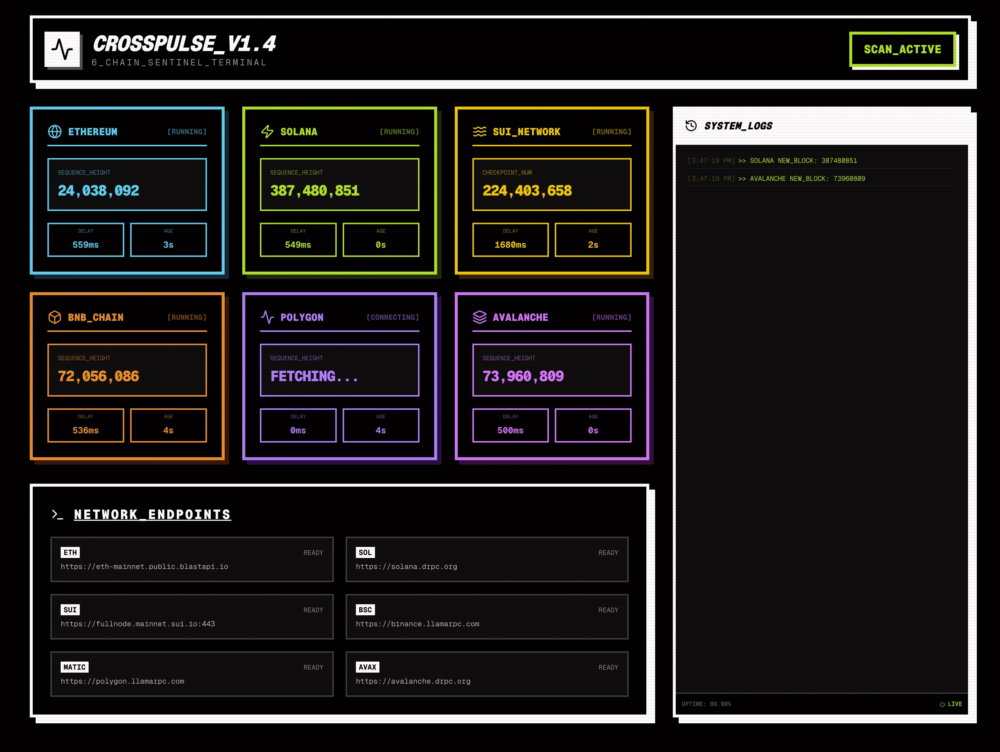

# CrossPulse

A real-time multi-chain blockchain monitoring dashboard with a retro terminal
aesthetic.




## Features

- **6 Chain Support** - Monitor Ethereum, Solana, SUI, BNB Chain, Polygon, and
  Avalanche simultaneously
- **Real-time Block Height** - Live tracking of the latest block/slot/checkpoint
  for each chain
- **Latency Monitoring** - RPC response time measurement for each network
- **Health Status** - Visual indicators for healthy, stalled, or error states
- **System Logs** - Live event feed with color-coded messages
- **Retro CRT Aesthetic** - Nostalgic terminal-style UI with scan lines effect

## Tech Stack

- **Framework**: Next.js 16 (App Router)
- **Language**: TypeScript
- **Styling**: Tailwind CSS 4
- **Icons**: Lucide React

## Supported Chains

| Chain       | Symbol | RPC Endpoint      |
| ----------- | ------ | ----------------- |
| Ethereum    | ETH    | BlastAPI          |
| Solana      | SOL    | DRPC              |
| SUI Network | SUI    | Official Fullnode |
| BNB Chain   | BSC    | LlamaRPC          |
| Polygon     | MATIC  | LlamaRPC          |
| Avalanche   | AVAX   | DRPC              |

## Getting Started

### Prerequisites

- Node.js 18+
- pnpm (recommended)

### Installation

```bash
# Clone the repository
git clone https://github.com/yourusername/crosspulse.git
cd crosspulse

# Install dependencies
pnpm install

# Start development server
pnpm dev
```

Open [http://localhost:3000](http://localhost:3000) to view the dashboard.

### Build for Production

```bash
pnpm build
pnpm start
```

## Deployment

### Cloudflare Pages

1. Connect your GitHub repository to Cloudflare Pages
2. Configure build settings:
   - **Build command**: `pnpm build`
   - **Build output directory**: `.next`
   - **Framework preset**: Next.js

### Vercel

```bash
npx vercel
```

## Configuration

Chain configurations can be modified in `app/page.tsx`:

```typescript
const CHAIN_CONFIGS = [
    {
        id: "eth",
        name: "ETHEREUM",
        symbol: "ETH",
        rpc: "https://eth-mainnet.public.blastapi.io",
        threshold: 30, // seconds before marking as stalled
        // ...
    },
    // ...
];
```

## License

MIT

## Author

Built with ⚡ for the Web3 community
